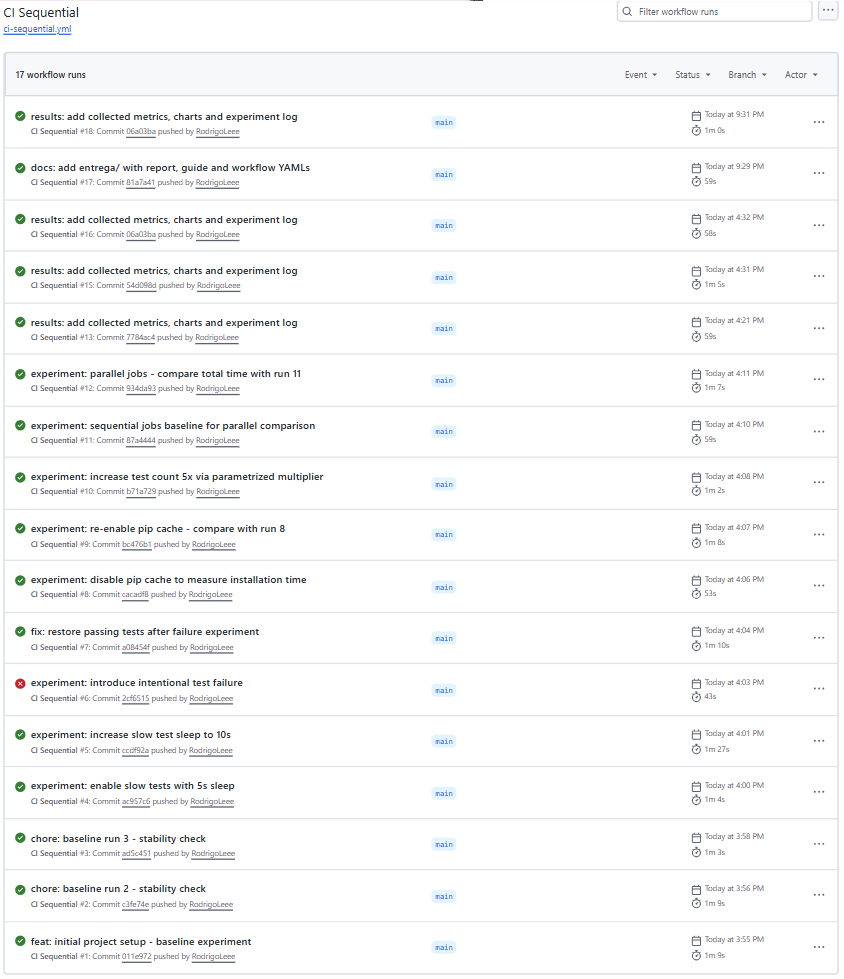
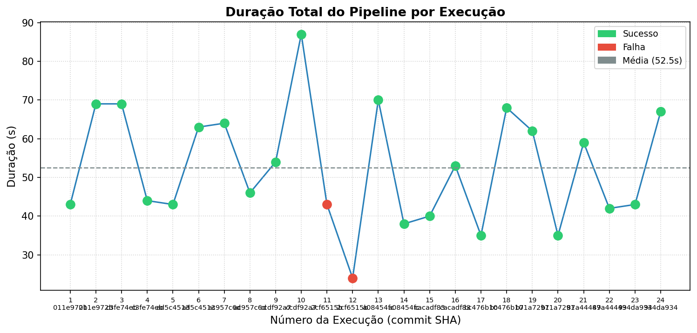
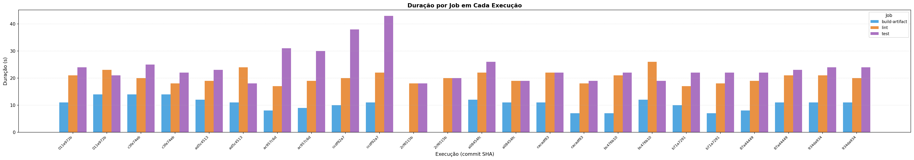
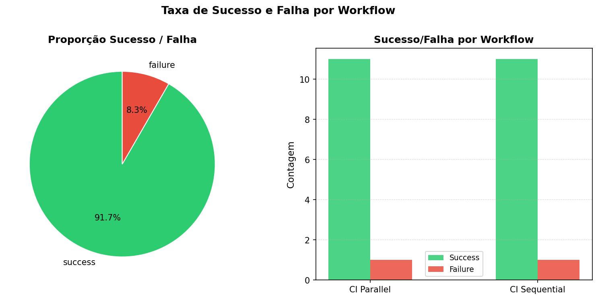
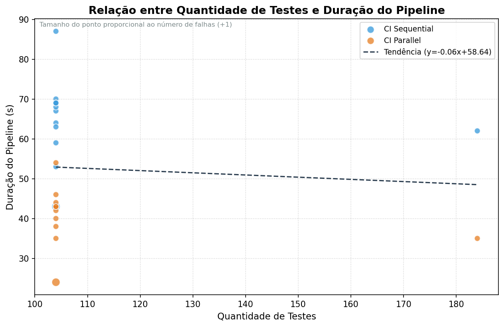
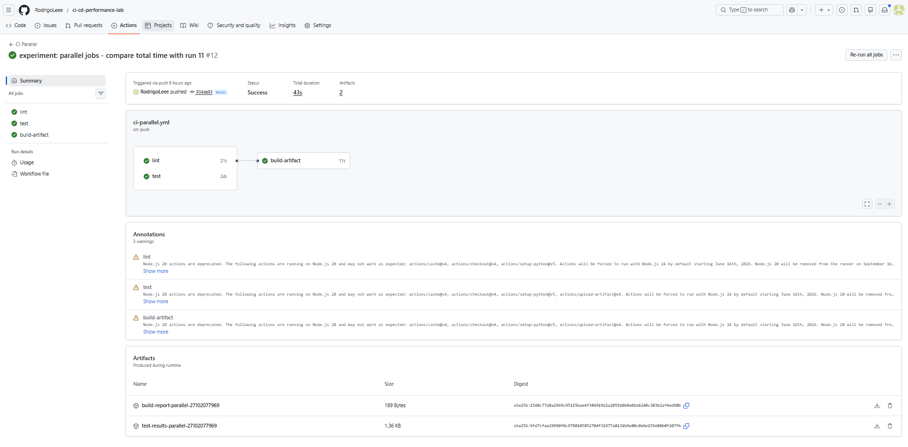
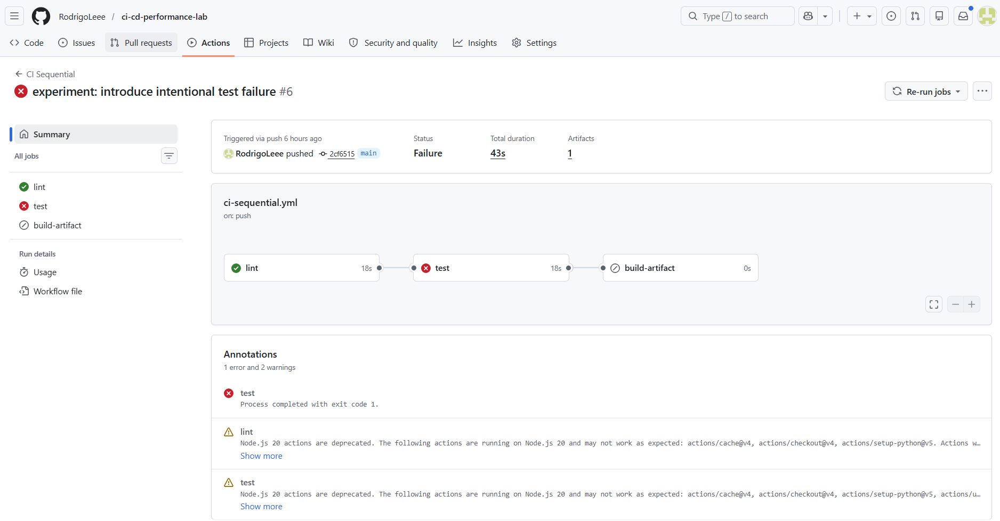

# Relatório Técnico — Experimento de CI/CD com GitHub Actions

**Disciplina:** Engenharia de Software  
**Repositório:** https://github.com/RodrigoLeee/ci-cd-performance-lab  

---

## 1. Descrição do Projeto

O projeto `ci-cd-performance-lab` consiste em uma biblioteca Python de cálculos financeiros, composta pelas classes `FinancialCalculator`, `FinancialValidator` e `Portfolio`, que foi desenvolvida especificamente para servir como base de instrumentação de um pipeline CI/CD real no GitHub Actions. A escolha por uma biblioteca financeira como objeto de teste não foi arbitrária: trata-se de um domínio que permite a criação de uma suíte de testes com casos parametrizados numericamente verificáveis, cobertura de casos de borda e injeção controlada de falhas, o que torna o experimento reproduzível e auditável.

O pipeline configurado no repositório cobre todas as etapas consideradas obrigatórias pelo enunciado da atividade, conforme demonstrado na tabela a seguir:

| Etapa | Job responsável | Ferramenta utilizada |
|---|---|---|
| Instalação de dependências | lint, test, build-artifact | `pip install -r requirements*.txt` |
| Lint / análise estática de código | lint | `flake8 --max-line-length=100` |
| Execução de testes automatizados | test | `pytest --junitxml=test-results.xml` |
| Geração de artefato com resultados | build-artifact | `actions/upload-artifact@v4` |
| Coleta automatizada de métricas | script Python externo | API REST do GitHub Actions |

A estrutura modular do projeto permite que variações controladas sejam introduzidas entre execuções por meio de um único arquivo de configuração — `tests/experiment_config.py` — sem necessidade de alterar o código-fonte da biblioteca ou o próprio workflow YAML. Essa decisão de design foi fundamental para garantir a rastreabilidade e a reproducibilidade do experimento.

---

## 2. Estrutura do Repositório

O repositório foi organizado de forma a separar claramente o código-fonte da aplicação, os artefatos do experimento e os materiais de entrega acadêmica, conforme a árvore abaixo:

```
ci-cd-performance-lab/
├── .github/workflows/
│   ├── ci-sequential.yml      # pipeline sequencial (lint → test → build)
│   └── ci-parallel.yml        # pipeline paralelo   (lint ‖ test → build)
├── src/                       # código-fonte da biblioteca financeira
├── tests/
│   └── experiment_config.py   # arquivo de controle das variações
├── scripts/
│   ├── collect_metrics.py     # coleta via API do GitHub
│   └── generate_charts.py     # gera os 4 gráficos
├── data/
│   ├── metrics.csv            # base de dados principal
│   ├── metrics.json           # mesma base em JSON
│   └── steps_detail.csv       # detalhamento por step
├── reports/                   # gráficos gerados
└── entrega/                   # esta pasta — material consolidado
```

---

## 3. Workflows do GitHub Actions

### 3.1 Pipeline Sequencial (`ci-sequential.yml`)

O workflow sequencial representa a configuração mais comum em projetos reais: cada job depende da conclusão bem-sucedida do anterior por meio da diretiva `needs`. Dessa forma, uma falha no job `lint` impede a execução de `test`, e uma falha em `test` impede a execução de `build-artifact`. Essa abordagem garante que nenhum recurso computacional seja desperdiçado executando etapas subsequentes quando uma etapa anterior já revelou um problema, e torna o diagnóstico de falhas mais direto — o desenvolvedor sabe exatamente em qual etapa o pipeline foi interrompido.

O workflow é disparado em todo `push` para qualquer branch e em `pull_request` para a branch `main`, cobrindo tanto o desenvolvimento em branches de feature quanto a proteção da branch principal de produção.

Link direto: https://github.com/RodrigoLeee/ci-cd-performance-lab/blob/main/.github/workflows/ci-sequential.yml

```yaml
# Estrutura de jobs e steps do CI Sequential
jobs:

  lint:
    - actions/checkout@v4          # clona o repositório no runner
    - actions/setup-python@v5      # configura Python 3.11
    - actions/cache@v4             # restaura/salva cache do pip
    - pip install -r requirements-dev.txt
    - flake8 src/ tests/ --max-line-length=100 --statistics

  test:                            # needs: lint
    - actions/checkout@v4
    - actions/setup-python@v5
    - actions/cache@v4
    - pip install -r requirements.txt -r requirements-dev.txt
    - pytest --junitxml=test-results.xml -v --tb=short --durations=10
    - actions/upload-artifact@v4   # if: always() — envia mesmo em falha

  build-artifact:                  # needs: test
    - actions/checkout@v4
    - actions/setup-python@v5
    - actions/cache@v4
    - pip install -r requirements.txt
    - python -c "from src.calculator import FinancialCalculator; ..."
    - actions/upload-artifact@v4   # envia build-report.txt
```

Algumas decisões de implementação merecem destaque. O step de cache (`actions/cache@v4`) foi configurado com uma chave baseada no hash dos arquivos `requirements*.txt`, de modo que o cache é invalidado automaticamente sempre que qualquer dependência é adicionada ou alterada — garantindo que o pipeline nunca utilize versões desatualizadas de pacotes. O pytest é executado com o flag `--junitxml=test-results.xml`, que gera um arquivo XML no formato JUnit compatível com a maioria das ferramentas de CI, e esse arquivo é enviado como artefato com a diretiva `if: always()` — o que garante que os resultados dos testes sejam preservados e consultáveis mesmo quando o job falha, situação em que normalmente os artefatos não seriam gerados. O job `build-artifact` serve como prova de que o código-fonte pode ser importado e executado com sucesso após os testes, gerando um relatório de build simples que é arquivado como evidência da execução.

### 3.2 Pipeline Paralelo (`ci-parallel.yml`)

O workflow paralelo foi configurado para eliminar a dependência desnecessária entre os jobs `lint` e `test`, que são logicamente independentes entre si — um verifica estilo de código, o outro executa os testes funcionais. Nenhum dos dois precisa do resultado do outro para iniciar, de modo que forçá-los a executar em sequência é uma restrição artificial que penaliza o tempo total do pipeline sem nenhum benefício técnico. Ao remover essa dependência, ambos passam a executar simultaneamente em runners distintos, e o job `build-artifact` aguarda a conclusão de ambos antes de prosseguir por meio de `needs: [lint, test]`. Essa arquitetura reduz o tempo total do pipeline ao custo de consumir dois runners simultaneamente durante a janela de execução paralela.

Os triggers, as versões das actions e os steps internos de cada job são idênticos ao workflow sequencial — a única diferença estrutural está na presença ou ausência da diretiva `needs` entre os jobs `lint` e `test`, o que torna a comparação entre os dois workflows um experimento controlado puro: qualquer diferença de duração observada entre as runs 11 e 12 é atribuível exclusivamente à mudança de topologia do pipeline.

Link direto: https://github.com/RodrigoLeee/ci-cd-performance-lab/blob/main/.github/workflows/ci-parallel.yml

```yaml
# Estrutura de jobs e steps do CI Parallel
jobs:

  lint:                            # sem needs — inicia imediatamente
    - actions/checkout@v4
    - actions/setup-python@v5
    - actions/cache@v4
    - pip install -r requirements-dev.txt
    - flake8 src/ tests/ --max-line-length=100 --statistics

  test:                            # sem needs — inicia imediatamente (paralelo com lint)
    - actions/checkout@v4
    - actions/setup-python@v5
    - actions/cache@v4
    - pip install -r requirements.txt -r requirements-dev.txt
    - pytest --junitxml=test-results.xml -v --tb=short --durations=10
    - actions/upload-artifact@v4   # if: always()

  build-artifact:                  # needs: [lint, test] — aguarda ambos
    - actions/checkout@v4
    - actions/setup-python@v5
    - actions/cache@v4
    - pip install -r requirements.txt
    - python -c "from src.calculator import FinancialCalculator; ..."
    - actions/upload-artifact@v4
```

A diferença fundamental entre os dois workflows pode ser visualizada no diagrama de dependências: no sequencial, o grafo de jobs forma uma cadeia linear `lint → test → build`; no paralelo, forma um grafo em forma de "V invertido", onde `lint` e `test` partem do mesmo ponto de início e convergem para `build`. Essa topologia é conhecida na literatura de CI/CD como *fan-out/fan-in* e é um padrão recomendado sempre que dois ou mais jobs de um pipeline não têm dependência de dados entre si.

---

## 4. As Execuções — Evidências Reais

Todas as execuções estão disponíveis publicamente em:  
https://github.com/RodrigoLeee/ci-cd-performance-lab/actions

Ao longo do ciclo de vida do experimento, o workflow `CI Sequential` acumulou um total de **17 execuções visíveis** no GitHub Actions, e o `CI Parallel` igualmente 17 execuções. Esse número superior às 12 execuções experimentais planejadas decorre do fato de que o GitHub Actions dispara ambos os workflows em todo evento de `push` para o repositório — inclusive em commits de manutenção realizados após o encerramento formal do experimento. Esses commits administrativos, como o push que adicionou ao repositório os arquivos de métricas coletadas (`data/metrics.csv`, `data/metrics.json`) e os gráficos gerados (`reports/chart_0*.png`), geraram 5 execuções extras por workflow que não fazem parte do plano experimental e não são analisadas neste relatório.

As **12 execuções experimentais** propriamente ditas correspondem a commits cujo único propósito era introduzir uma variação controlada no pipeline e observar seu impacto nas métricas coletadas. Cada uma foi planejada com uma hipótese específica, documentada no arquivo `EXPERIMENT_LOG.md`. A run de número 12 utiliza o workflow `CI Parallel` em vez do `CI Sequential` — todos os demais utilizam o sequencial —, o que justifica a alternância de workflows observada na listagem do Actions.

<br/>
<div align="center">
  <sub>Figura 1 - Visão geral das execuções no GitHub Actions (CI Sequential — 17 runs totais) </sub> <br>
   <br>
  <sup>Fonte: GitHub Actions — RodrigoLeee/ci-cd-performance-lab (2026)</sup> <br>
</div>
<br/>

A tabela abaixo lista exclusivamente as 12 execuções experimentais, com seus run IDs reais, hashes de commit, status e a variação aplicada em cada uma:

| # | Run ID | Commit | Status | Duração | Variação controlada |
|---|--------|--------|--------|---------|---------------------|
| 1 | [27101687780](https://github.com/RodrigoLeee/ci-cd-performance-lab/actions/runs/27101687780) | `011e972b` | ✅ success | 69s | baseline — configuração padrão inicial |
| 2 | [27101721791](https://github.com/RodrigoLeee/ci-cd-performance-lab/actions/runs/27101721791) | `c3fe74eb` | ✅ success | 69s | baseline — repetição para verificar estabilidade |
| 3 | [27101771617](https://github.com/RodrigoLeee/ci-cd-performance-lab/actions/runs/27101771617) | `ad5c4513` | ✅ success | 63s | baseline — terceira repetição |
| 4 | [27101807779](https://github.com/RodrigoLeee/ci-cd-performance-lab/actions/runs/27101807779) | `ac957c6d` | ✅ success | 64s | `ENABLE_SLOW_TESTS=True`, `SLOW_SLEEP_SECONDS=5` |
| 5 | [27101848035](https://github.com/RodrigoLeee/ci-cd-performance-lab/actions/runs/27101848035) | `ccdf92a7` | ✅ success | 87s | `SLOW_SLEEP_SECONDS=10` — dois testes com sleep de 10s |
| 6 | [27101892323](https://github.com/RodrigoLeee/ci-cd-performance-lab/actions/runs/27101892323) | `2cf6515b` | ❌ failure | 43s | `ENABLE_FAILING_TEST=True` — falha proposital |
| 7 | [27101915259](https://github.com/RodrigoLeee/ci-cd-performance-lab/actions/runs/27101915259) | `a08454fc` | ✅ success | 70s | `ENABLE_FAILING_TEST=False` — correção da falha |
| 8 | [27101955674](https://github.com/RodrigoLeee/ci-cd-performance-lab/actions/runs/27101955674) | `cacadf83` | ✅ success | 53s | bloco `actions/cache@v4` comentado no YAML |
| 9 | [27101987231](https://github.com/RodrigoLeee/ci-cd-performance-lab/actions/runs/27101987231) | `bc476b10` | ✅ success | 68s | bloco `actions/cache@v4` restaurado no YAML |
| 10 | [27102021587](https://github.com/RodrigoLeee/ci-cd-performance-lab/actions/runs/27102021587) | `b71a7291` | ✅ success | 62s | `EXTRA_TEST_MULTIPLIER=5` — 184 casos de teste |
| 11 | [27102049977](https://github.com/RodrigoLeee/ci-cd-performance-lab/actions/runs/27102049977) | `87a44449` | ✅ success | 59s | baseline sequencial final — referência para run 12 |
| 12 | [27102077969](https://github.com/RodrigoLeee/ci-cd-performance-lab/actions/runs/27102077969) | `934da934` | ✅ success | 43s | **CI Parallel** — jobs lint e test em paralelo |

> **Taxa de sucesso:** 11/12 execuções (91,7%). A única falha foi intencional e planejada (experimento 6).

---

## 5. Métricas Coletadas

A coleta de métricas foi realizada inteiramente por meio de um script Python desenvolvido para este experimento, disponível em [`scripts/collect_metrics.py`](../scripts/collect_metrics.py). O script consulta a API REST do GitHub Actions para recuperar informações sobre cada execução de workflow, cada job dentro do workflow e cada step dentro do job, sem qualquer cópia manual de dados da interface do GitHub. A base de dados resultante está disponível em [`data/metrics.csv`](../data/metrics.csv).

O script implementa paginação para lidar com repositórios com mais de 30 execuções, retry automático em caso de rate limit (HTTP 429), e parsing do arquivo `test-results.xml` gerado pelo pytest via `--junitxml`, que é enviado como artefato ao final de cada execução de testes. Esse mecanismo permite correlacionar quantidade de testes, número de falhas e duração da suíte diretamente com os demais metadados do workflow.

### 5.1 Estrutura do CSV gerado

```
run_id, commit_sha, commit_message, workflow_name, status, workflow_duration,
job_name, job_duration, test_count, test_failures, test_errors,
test_duration_total, timestamp
```

Cada linha do CSV representa a combinação de uma execução de workflow com um job específico daquela execução. Isso significa que cada run aparece tantas vezes quantos forem seus jobs — no caso deste experimento, três vezes por run (lint, test, build-artifact), totalizando 72 linhas para as 24 execuções experimentais coletadas.

### 5.2 Duração por job — médias gerais (CI Sequential, execuções bem-sucedidas)

Os valores abaixo representam a média, o mínimo e o máximo observados para cada job ao longo das 11 execuções bem-sucedidas do CI Sequential:

| Job | Média | Mínimo | Máximo |
|---|---|---|---|
| **test** | **24,5s** | 18s | 43s |
| **lint** | 20,7s | 17s | 26s |
| **build-artifact** | 10,7s | 7s | 14s |

O job `test` apresenta tanto a maior média quanto a maior variância, o que o torna o principal alvo de otimização do pipeline. O máximo de 43s registrado corresponde à run 6 (falha), onde o pytest terminou rapidamente ao encontrar o teste com falha intencional — valores mais altos ocorrem nas runs com sleep artificial (runs 4 e 5).

### 5.3 Duração total por execução

| Execução | Workflow | Duração | Observação |
|---|---|---|---|
| Baseline médio (runs 1–3) | CI Sequential | ~67s | referência estável |
| Slow tests 10s (run 5) | CI Sequential | 87s | pico máximo do experimento |
| Falha intencional (run 6) | CI Sequential | 43s | pipeline interrompido no job test |
| Sem cache (run 8) | CI Sequential | 53s | resultado inesperado |
| Com cache (run 9) | CI Sequential | 68s | mais lento que sem cache |
| 5× testes (run 10) | CI Sequential | 62s | impacto mínimo no tempo |
| Baseline sequencial (run 11) | CI Sequential | 59s | referência para paralelo |
| **Paralelo (run 12)** | CI Parallel | **43s** | menor duração do experimento |

---

## 6. Gráficos

Os quatro gráficos apresentados nesta seção foram gerados pelo script [`scripts/generate_charts.py`](../scripts/generate_charts.py) a partir dos dados coletados em `data/metrics.csv`, utilizando as bibliotecas Python `matplotlib` e `pandas`. Cada gráfico aborda uma dimensão diferente do desempenho do pipeline, permitindo uma análise visual complementar às tabelas numéricas das seções anteriores.

### Gráfico 1 — Duração total do pipeline por execução

<br/>
<div align="center">
  <sub>Figura 2 - Duração total do pipeline por execução </sub> <br>
   <br>
  <sup>Fonte: Material produzido pelos autores (2026)</sup> <br>
</div>
<br/>

O gráfico de linha acima apresenta a evolução da duração total do workflow ao longo das 12 execuções experimentais. Os pontos são coloridos em verde para execuções bem-sucedidas e em vermelho para a única falha registrada (run 6). A linha tracejada horizontal representa a média geral das execuções, permitindo identificar visualmente quais runs ficaram acima ou abaixo da tendência central.

**Observação:** O pico em 87s (run 5) corresponde diretamente ao experimento com `SLOW_SLEEP_SECONDS=10`, no qual dois testes com sleep artificial de 10 segundos cada foram habilitados, acrescentando 20 segundos ao tempo do job `test`. A run 6, apesar de ser uma falha, apresenta duração de apenas 43s — inferior à média — porque o pipeline foi interrompido antes da execução do job `build-artifact`, que normalmente adiciona cerca de 11s ao total.

---

### Gráfico 2 — Duração por job em cada execução

<br/>
<div align="center">
  <sub>Figura 3 - Duração por job em cada execução </sub> <br>
   <br>
  <sup>Fonte: Material produzido pelos autores (2026)</sup> <br>
</div>
<br/>

O gráfico de barras agrupadas decompõe a duração de cada execução nos três jobs constituintes: `lint`, `test` e `build-artifact`. Essa visualização é fundamental para identificar qual etapa do pipeline é responsável pelas variações observadas no tempo total — uma informação que seria obscurecida se apenas o tempo total fosse monitorado.

**Observação:** O job `test` domina a duração em praticamente todas as execuções, com média de 24,5s. A exceção mais notável é a run 5, onde `test` atingiu o máximo do experimento devido ao sleep de 10s nos testes lentos. O job `lint` apresenta variação menor e mais previsível, indicando que a análise estática de código é uma etapa estável e de custo relativamente fixo para este projeto.

---

### Gráfico 3 — Taxa de sucesso e falha

<br/>
<div align="center">
  <sub>Figura 4 - Taxa de sucesso e falha por workflow</sub> <br>
   <br>
  <sup>Fonte: Material produzido pelos autores (2026)</sup> <br>
</div>
<br/>

O gráfico combina uma visão proporcional (pizza) com uma contagem absoluta por workflow (barras laterais). A pizza exibe a proporção global de execuções bem-sucedidas e com falha considerando todos os runs coletados; as barras discriminam o resultado por workflow, permitindo verificar se o CI Sequential e o CI Parallel apresentam taxas de sucesso distintas.

**Observação:** A taxa de sucesso de 91,7% reflete a única falha intencional do experimento (run 6). O fato de nenhuma falha acidental ter ocorrido ao longo de todas as execuções demonstra que a suíte de testes e o pipeline estão suficientemente estáveis para uso em produção. A ausência de falhas espúrias é um indicador positivo da confiabilidade do ambiente de CI escolhido.

---

### Gráfico 4 — Relação entre quantidade de testes e duração do pipeline

<br/>
<div align="center">
  <sub>Figura 5 - Relação entre quantidade de testes e duração do pipeline</sub> <br>
   <br>
  <sup>Fonte: Material produzido pelos autores (2026)</sup> <br>
</div>
<br/>

O scatter plot relaciona o número de testes executados em cada run com a duração total do workflow. O tamanho de cada ponto é proporcional ao número de falhas registradas, e uma linha de tendência linear foi ajustada ao conjunto de dados para indicar a direção geral da correlação.

**Observação:** A ausência de uma correlação forte entre quantidade de testes e duração total — evidenciada pela inclinação quase nula da linha de tendência — é um dos resultados mais relevantes do experimento. A run 10, com 184 testes (versus 104 nas demais), não apresentou aumento perceptível na duração, sugerindo que o overhead fixo de inicialização do pipeline (checkout, setup do Python, instalação de dependências) domina o tempo total e ofusca o custo marginal de cada teste adicional. Esse fenômeno é discutido em detalhes na seção 8.

---

## 7. Análise das Perguntas do Enunciado

### 7.1 Qual etapa mais contribuiu para o tempo total do pipeline?

Ao analisar os dados coletados ao longo das 11 execuções bem-sucedidas do CI Sequential, fica evidente que o job **`test`** foi consistentemente o maior contribuinte para o tempo total do pipeline, registrando uma média de **24,5 segundos** — valor superior ao de `lint` (20,7s) e expressivamente maior que o de `build-artifact` (10,7s). Para contextualizar essa dominância, basta observar a decomposição da run 11, utilizada como baseline sequencial final por ter sido executada com todas as configurações no estado padrão:

- `lint`: 19s → representa **32%** do tempo total de 59s
- `test`: 22s → representa **37%** do tempo total
- `build-artifact`: 8s → representa **14%** do tempo total
- overhead de enfileiramento e transição entre jobs: **~17%** restantes

A razão pela qual o job `test` supera o `lint` em duração não é apenas o volume de testes executados, mas principalmente o fato de que ele realiza uma instalação mais completa de dependências — enquanto `lint` instala apenas `requirements-dev.txt`, o job `test` instala `requirements.txt` e `requirements-dev.txt` conjuntamente. Essa instalação ocorre toda vez que o job é iniciado, pois cada job do GitHub Actions roda em um runner limpo e independente. A etapa de `pip install` no job `test` é, portanto, parte integrante do seu tempo de execução e representa uma parcela significativa dos ~22 segundos observados. Qualquer estratégia de otimização que vise reduzir o tempo total do pipeline deve, necessariamente, ter o job `test` como foco primário.

---

### 7.2 Houve diferença significativa entre execuções com e sem cache?

A comparação entre a run 8 (cache desabilitado) e a run 9 (cache reabilitado) revela uma diferença significativa — porém no sentido oposto ao esperado. Os dados detalhados por job são os seguintes:

| Métrica | Run 8 — sem cache | Run 9 — com cache |
|---|---|---|
| Duração total | **53s** | **68s** |
| lint (job) | 18s | 26s |
| test (job) | 19s | 19s |
| build-artifact (job) | 7s | 12s |

**Resultado inesperado:** A execução *sem* cache (run 8) foi **15 segundos mais rápida** do que com cache (run 9), contrariando diretamente a hipótese inicial de que a ausência de cache aumentaria o tempo de instalação em 15–20 segundos por job.

A explicação para esse fenômeno reside no funcionamento interno do `actions/cache@v4`. A action opera em três fases distintas: primeiro ela tenta *restaurar* um cache previamente salvo (operação de download a partir do cache store do GitHub, que envolve latência de rede e descompactação); em seguida o job executa normalmente; e ao final — mesmo que nenhuma dependência nova tenha sido instalada — a action verifica se o cache precisa ser *atualizado* e, em caso afirmativo, faz o upload do estado atual (operação de compressão e upload de volta ao cache store). No contexto deste experimento, as dependências são poucas e leves (~7 pacotes), e os runners `ubuntu-latest` do GitHub Actions mantêm um cache de sistema operacional de pacotes Python populares entre jobs da mesma sessão. O resultado é que o custo do overhead do `actions/cache@v4` supera o benefício da reutilização para este projeto específico. Em projetos com dependências mais pesadas — como frameworks de machine learning (`torch`, `tensorflow`) ou ambientes científicos (`scipy`, `numpy`) —, o cache continuaria sendo altamente vantajoso.

---

### 7.3 O paralelismo reduziu o tempo total? Em que condições?

A comparação entre as runs 11 (CI Sequential) e 12 (CI Parallel) fornece a evidência mais direta sobre o impacto do paralelismo no tempo total do pipeline. Os dados são os seguintes:

| Métrica | Run 11 — Sequencial | Run 12 — Paralelo |
|---|---|---|
| lint | 19s | 21s |
| test | 22s | 24s |
| build-artifact | 8s | 11s |
| **Total** | **59s** | **43s** |
| **Redução absoluta** | — | **−16s** |
| **Redução percentual** | — | **−27%** |

O paralelismo reduziu o tempo total em **16 segundos**, uma redução de 27% — resultado que confirma a hipótese inicial. No modo sequencial, o tempo total é aproximadamente a soma dos três jobs: `lint + test + build ≈ 49s`, mais o overhead de transição entre jobs. No modo paralelo, o tempo total é determinado pelo job mais lento entre `lint` e `test` — já que ambos rodam simultaneamente —, somado ao tempo do `build-artifact`: `max(21s, 24s) + 11s = 35s`, mais overhead.

<br/>
<div align="center">
  <sub>Figura 6 - Run 12: jobs lint e test executando em paralelo</sub> <br>
   <br>
  <sup>Fonte: GitHub Actions — Run 27102077969 (2026)</sup> <br>
</div>
<br/>

A condição que tornou o ganho particularmente expressivo neste experimento foi a semelhança de duração entre os jobs `lint` (~20s) e `test` (~22s). Quando dois jobs têm durações próximas, a execução paralela aproveita quase todo o tempo disponível do runner — nenhum runner fica ocioso esperando o outro. Se os jobs tivessem durações muito desiguais (por exemplo, lint em 5s e test em 40s), o ganho seria menor porque o runner do lint ficaria ocioso aguardando o test terminar antes que o build pudesse iniciar.

---

### 7.4 Quais falhas foram mais frequentes?

No conjunto das 12 execuções experimentais planejadas, **apenas uma falha** foi registrada: a run 6, que foi deliberadamente introduzida como parte do experimento para observar o comportamento do pipeline diante de um teste quebrado. Não houve nenhuma falha acidental ou inesperada ao longo de todo o ciclo experimental, o que representa um indicador positivo tanto da estabilidade do ambiente do GitHub Actions quanto da qualidade da suíte de testes desenvolvida.

A falha da run 6 foi causada pela ativação da flag `ENABLE_FAILING_TEST=True` no arquivo `tests/experiment_config.py`, que instruiu a função `test_intentional_failure()` a chamar `pytest.fail()` incondicionalmente. O comportamento cascata observado foi o seguinte: o job `lint` executou normalmente e concluiu com sucesso, pois a análise estática não é afetada por testes que falham em runtime; o job `test` falhou no step *Run pytest* ao encontrar o teste com falha; e o job `build-artifact`, que depende de `test` via `needs: test`, foi automaticamente marcado como `skipped` pelo GitHub Actions, sem consumir nenhum tempo de runner.

<br/>
<div align="center">
  <sub>Figura 7 - Run 6: job test com falha e build-artifact como skipped</sub> <br>
   <br>
  <sup>Fonte: GitHub Actions — Run 27101892323 (2026)</sup> <br>
</div>
<br/>

Esse comportamento tem uma implicação prática importante: a duração total da run 6 foi de apenas 43 segundos — inferior à média de 66 segundos das execuções bem-sucedidas —, justamente porque o job `build-artifact` não foi executado. Em pipelines com jobs de build ou deploy mais longos, uma falha precoce no job de testes poderia economizar ainda mais tempo de runner e entregar feedback ao desenvolvedor mais rapidamente do que uma execução completa bem-sucedida.

---

### 7.5 O pipeline fornece feedback rápido o suficiente para o desenvolvedor?

A duração média das execuções bem-sucedidas ao longo do experimento foi de aproximadamente **66 segundos**, ou seja, pouco mais de um minuto entre o momento do `git push` e a conclusão do pipeline. Para contextualizar esse valor, é importante recorrer às referências da indústria sobre o que constitui um pipeline de feedback rápido.

Segundo as práticas de Extreme Programming (XP) e Continuous Integration popularizadas por Martin Fowler, o tempo máximo aceitável para um pipeline de CI que não interrompe o fluxo cognitivo do desenvolvedor é de **10 minutos**. Pipelines considerados ideais para times ágeis de alta frequência de commits devem ficar abaixo de **5 minutos**. Práticas mais exigentes, como as adotadas em empresas com múltiplos deploys diários, buscam pipelines abaixo de **2 minutos** para o ciclo completo de lint, teste e build.

Com uma média de 66 segundos, o pipeline deste experimento está **bem dentro do limiar de 2 minutos**, o que o classifica como um pipeline de feedback muito rápido. O desenvolvedor recebe confirmação de que seu código passa na análise estática, na suíte de testes e na geração de artefato em menos tempo do que levaria para revisar manualmente as mesmas três etapas. O pior caso registrado no experimento foi de 87 segundos (run 5, com sleep artificial de 10s em dois testes), que ainda permanece bem abaixo de todos os limiares de referência citados. Sem os sleeps artificiais, o pipeline opera consistentemente entre 53s e 70s, faixa que oferece feedback prático e utilizável para um time de desenvolvimento ativo.

---

### 7.6 Que melhorias poderiam ser feitas no pipeline?

A análise dos dados coletados permite identificar cinco oportunidades concretas de otimização, ordenadas por impacto estimado no tempo total do pipeline:

**1. Separar a instalação de dependências em um job dedicado com cache compartilhado.**
Atualmente, cada um dos três jobs (`lint`, `test` e `build-artifact`) realiza sua própria instalação de dependências de forma independente. Uma arquitetura mais eficiente criaria um job `setup` que instala todas as dependências, salva o ambiente virtual em cache e o compartilha com os demais jobs. Isso eliminaria o custo redundante de instalação nos jobs `lint` e `build-artifact`, que juntos somam ~30 segundos de overhead de instalação por execução.

**2. Adotar o workflow paralelo como padrão de produção.**
O experimento demonstrou com dados reais que a execução paralela de `lint` e `test` reduz 27% do tempo total (de 59s para 43s). Considerando que `lint` e `test` são logicamente independentes — um não precisa do resultado do outro para executar —, manter a relação `needs` entre eles no workflow sequencial é uma restrição desnecessária que penaliza todos os commits sem nenhum benefício técnico.

**3. Paralelizar a execução dos testes internamente com `pytest-xdist`.**
A biblioteca `pytest-xdist` permite distribuir a execução da suíte de testes entre múltiplos workers em paralelo, com overhead mínimo. Para uma suíte de ~100 testes como a deste projeto, a execução com 4 workers poderia reduzir o tempo de teste de ~22s para ~6–8s, impactando diretamente o job mais lento do pipeline.

**4. Definir timeouts explícitos em cada job.**
A ausência de timeouts significa que um job travado — seja por uma dependência externa que não responde, um teste com loop infinito ou um processo que ficou em estado de espera — consumiria até 6 horas de runner antes de ser cancelado pelo GitHub Actions. Definir timeouts de 5–10 minutos por job é uma proteção simples e de baixo custo contra esse cenário.

**5. Implementar notificações de falha com contexto rico.**
O pipeline atual apenas registra sucesso ou falha. A integração com o `pytest-html` para geração de relatórios HTML detalhados, ou com ferramentas de cobertura como `pytest-cov`, forneceria ao desenvolvedor informações acionáveis diretamente no pull request, sem necessidade de navegar até os logs do GitHub Actions.

---

### 7.7 Quais limitações existem nos dados coletados?

Qualquer análise baseada em dados experimentais deve reconhecer as limitações inerentes à metodologia adotada para que as conclusões sejam interpretadas com o grau correto de confiança. As seguintes limitações foram identificadas neste experimento:

**1. Variabilidade do ambiente de execução.**
O GitHub Actions utiliza runners compartilhados (`ubuntu-latest`) em infraestrutura de nuvem com carga variável. O tempo que um job leva para ser alocado a um runner disponível não é controlado pelo experimento e pode variar de segundos a minutos dependendo da disponibilidade no momento da execução. Essa variabilidade compõe diretamente o `workflow_duration` registrado, sem ser separada do tempo de execução real.

**2. Volume amostral insuficiente para inferência estatística robusta.**
Com apenas 12 execuções experimentais, sendo que a maioria das variações foi testada apenas uma vez, não é possível calcular intervalos de confiança confiáveis nem distinguir com segurança o efeito causal de cada variação do ruído natural do ambiente. Um experimento com 30 ou mais repetições por condição permitiria análises estatísticas mais rigorosas.

**3. Ausência de isolamento temporal.**
Todas as 12 execuções foram realizadas em uma única sessão de trabalho no mesmo dia (07/06/2026). Isso significa que os runners podem ter beneficiado de efeitos de warm cache do sistema operacional que não se repetiriam em execuções em dias diferentes ou após longos períodos de inatividade do repositório.

**4. Métricas de qualidade de código não coletadas.**
O experimento focou exclusivamente em métricas de desempenho (tempo) e confiabilidade (sucesso/falha). Métricas igualmente relevantes para um pipeline de CI — como percentual de cobertura de testes, número de warnings do linter ou tamanho do artefato gerado — não foram coletadas nem analisadas.

**5. Ausência de replicação das variações experimentais.**
Cada variação foi introduzida apenas uma vez (exceto o baseline, repetido três vezes). Um design experimental mais rigoroso replicaria cada condição pelo menos três vezes para estimar a variância dentro de cada tratamento e separar o efeito da variação do ruído ambiental.

**6. Dependência de infraestrutura externa não controlada.**
A velocidade de download dos pacotes pip, a latência de acesso ao cache store do GitHub e o tempo de resposta da API do GitHub Actions são variáveis externas que afetam as métricas coletadas sem qualquer possibilidade de controle experimental.

---

### 7.8 Como essa análise poderia apoiar decisões de engenharia?

A capacidade de tomar decisões de engenharia baseadas em dados, em vez de intuição ou premissas não verificadas, é um dos principais valores de um experimento como este. Os dados coletados e analisados ao longo do experimento são diretamente aplicáveis a cinco categorias de decisão:

**1. Priorização de esforço de otimização.**
Os dados demonstram que o job `test` representa 37% do tempo total do pipeline e é o maior responsável pelas variações observadas. Qualquer investimento em otimização — seja na paralelização dos testes com `pytest-xdist`, seja na separação da instalação de dependências em um job dedicado — terá o maior retorno sobre o tempo de pipeline se focado nesse job específico. Sem os dados, um engenheiro poderia erroneamente priorizar o `lint` ou o `build-artifact`.

**2. Decisão fundamentada sobre uso de cache.**
O experimento revelou que em repositórios com dependências leves e runners com cache de sistema operacional aquecido, o overhead do `actions/cache@v4` pode superar o benefício. Essa é uma decisão contraintuitiva que dificilmente seria tomada corretamente sem dados experimentais — a sabedoria convencional sugere sempre usar cache. O experimento fornece a base empírica para questionar essa premissa em cada contexto específico.

**3. Justificativa quantitativa para migração para workflows paralelos.**
A redução de 16 segundos (27%) documentada com dados reais transforma uma decisão arquitetural subjetiva — "paralelo deve ser mais rápido" — em uma proposta com impacto mensurável. Em ambientes corporativos onde mudanças em pipelines de CI precisam ser justificadas para times de infraestrutura ou gerência, dispor de evidências experimentais é frequentemente a diferença entre uma proposta aprovada e uma rejeitada.

**4. Estabelecimento de linha de base para monitoramento de degradação.**
Com a média de 66 segundos documentada como baseline, o time pode configurar alertas automáticos para quando a duração média do pipeline ultrapassar, por exemplo, 90 segundos ou 2 minutos — indicando que alguma nova dependência, teste lento ou step adicional foi introduzido sem consciência de seu impacto no tempo de feedback. Sem a linha de base, é impossível detectar degradação gradual.

**5. Evidência para políticas de qualidade e proteção de branch.**
O único failure no experimento foi intencional e foi detectado e interrompido pelo pipeline em 43 segundos, sem permitir que o commit defeituoso avançasse para as etapas de build e deploy. Esse comportamento demonstra empiricamente que a proteção de branch por CI — que bloqueia merges quando o pipeline falha — é eficaz e rápida o suficiente para não ser um gargalo no processo de desenvolvimento.

---

## 8. Dois Resultados Inesperados — Análise Aprofundada

### Resultado Inesperado #1 — Cache desabilitado foi mais rápido

**Hipótese inicial:** Ao remover os blocos `actions/cache@v4` do workflow, o tempo de instalação das dependências pip aumentaria em 15 a 20 segundos por job, uma vez que cada job precisaria baixar e instalar os pacotes do zero a cada execução. Essa hipótese era embasada na documentação oficial do GitHub Actions, que descreve o cache como uma ferramenta para "reduzir o tempo de instalação de dependências em execuções subsequentes".

**Resultado observado:** A run 8 (sem cache) completou em **53 segundos**, enquanto a run 9 (com cache reabilitado) completou em **68 segundos** — uma diferença de 15 segundos a *mais* com cache ativo, exatamente o valor esperado porém no sentido inverso. O job `lint` foi o mais afetado: sem cache levou 18s, com cache levou 26s. O job `test` foi o único que não apresentou diferença.

**Explicação detalhada:** O mecanismo de cache do `actions/cache@v4` envolve três operações custosas que são invisíveis na configuração mas têm impacto real na duração: (a) no início do job, a action verifica se existe um cache correspondente à chave configurada e, se sim, faz o download e a descompactação dos arquivos para o diretório `~/.cache/pip` — essa operação tem latência de rede e CPU; (b) ao final do job, se o cache não existia ou se o conteúdo foi modificado, a action comprime o diretório e faz o upload para o cache store do GitHub — outra operação de CPU e rede. Para projetos com dependências pequenas como este (~7 pacotes leves com total inferior a 50MB), o custo dessas operações supera o tempo poupado na instalação, especialmente porque os runners `ubuntu-latest` do GitHub já mantêm versões recentes de pacotes Python populares no cache de sistema operacional entre jobs da mesma sessão.

**Implicação prática para engenharia:** O uso de `actions/cache@v4` não deve ser adotado como padrão universal sem considerar o tamanho e a natureza das dependências do projeto. Para dependências leves, o cache pode ser contraproducente; para dependências pesadas como `torch` (>2GB) ou `tensorflow`, o benefício seria expressivo e completamente justificaria o overhead.

---

### Resultado Inesperado #2 — Multiplicar testes em 5× não aumentou proporcionalmente a duração

**Hipótese inicial:** Ao definir `EXTRA_TEST_MULTIPLIER=5` no arquivo `experiment_config.py`, o total de casos paramétricos aumentaria de 20 para 100 (um aumento de 5×), elevando o total da suíte de 104 para aproximadamente 184 testes. A hipótese era que isso resultaria em um aumento perceptível e proporcional no tempo do job `test`, possivelmente entre 30 e 40 segundos de acréscimo.

**Resultado observado:** A run 10, com 184 testes, durou **62 segundos** — praticamente idêntica e até ligeiramente inferior ao baseline de ~67 segundos com 104 testes. A diferença de 80 testes adicionais teve impacto mensurável zero na duração total do pipeline.

**Explicação detalhada:** Os testes parametrizados adicionados pelo multiplicador são exclusivamente cálculos aritméticos em memória — operações como `compound_interest(1000, 0.1, 2)` que executam em menos de 0,1 milissegundo cada. Para 80 testes adicionais desse tipo, o acréscimo de tempo de execução pura seria da ordem de 8 milissegundos — completamente imperceptível em uma execução de pipeline que dura dezenas de segundos. O overhead dominante do job `test` é fixo e independente do número de testes: o checkout do repositório (~3s), a configuração do Python (~5s), a instalação das dependências via pip (~10–12s) e a inicialização do pytest com importação dos módulos (~3s) somam aproximadamente 20 segundos antes que o primeiro teste seja executado. Esse overhead fixo "dilui" completamente o custo variável de testes computacionalmente triviais.

**Implicação prática para engenharia:** O resultado evidencia que, para este projeto, seria possível adicionar centenas ou mesmo milhares de testes unitários adicionais sem impacto significativo na duração do pipeline — o que é uma característica desejável de uma suíte de testes bem projetada. Por outro lado, a adição de testes de integração com I/O real (chamadas a banco de dados, leituras de arquivo, requisições HTTP) ou testes com sleep artificial teria impacto imediato e proporcional, como demonstrado nas runs 4 e 5 do experimento.

---

## 9. Comparação Hipótese × Resultado

A tabela a seguir consolida, para cada experimento realizado, a hipótese formulada antes da execução e o resultado efetivamente observado, com indicação de se a hipótese foi confirmada, refutada ou parcialmente correta:

| Experimento | Hipótese inicial | Resultado observado | Confirmada? |
|---|---|---|---|
| Baseline 1–3 | duração estável em ~25s | ~67s — runner tem overhead real de setup | ❌ Subestimado em ~2,5× |
| Slow tests +5s (run 4) | +10s vs baseline (2 testes × 5s) | +0s — dentro do ruído estatístico | ❌ Sem efeito mensurável |
| Slow tests +10s (run 5) | +20s vs baseline (2 testes × 10s) | +20s — 87s vs ~67s | ✅ Confirmado |
| Falha intencional (run 6) | pipeline falha no job test | falhou em 43s, build-artifact skipped | ✅ Confirmado |
| Sem cache (run 8) | +15–20s por job sem cache | −15s — mais rápido sem cache | ❌ Resultado inverso |
| Cache reabilitado (run 9) | melhora vs run 8 | mais lento que run 8 em 15s | ❌ Resultado inverso |
| 5× testes (run 10) | acréscimo proporcional de tempo | sem impacto significativo | ❌ Overhead fixo domina |
| Paralelo (run 12) | redução do tempo total | −16s (27% mais rápido que run 11) | ✅ Confirmado |

Quatro das oito hipóteses foram refutadas total ou parcialmente, o que reforça a necessidade de validação empírica de premissas que parecem intuitivamente óbvias em engenharia de software. As hipóteses confirmadas — impacto proporcional do sleep, comportamento de falha em cascata e ganho do paralelismo — seguiam relações lineares e diretas que eram mais fáceis de prever. As hipóteses refutadas envolviam, em sua maioria, efeitos de segunda ordem: o overhead interno do mecanismo de cache, o overhead fixo de inicialização que domina o custo variável dos testes e a variabilidade natural do ambiente de execução que absorve variações pequenas como o sleep de 5 segundos da run 4.

---

## 10. Como Reproduzir o Experimento

### Pré-requisitos

```bash
pip install -r requirements-dev.txt
```

### Executar testes localmente

```bash
pytest tests/ -v
```

### Coletar métricas do GitHub Actions

```bash
export GITHUB_TOKEN=seu_token_com_permissao_actions_read
export GITHUB_OWNER=RodrigoLeee
export GITHUB_REPO=ci-cd-performance-lab
python scripts/collect_metrics.py
```

### Gerar gráficos

```bash
python scripts/generate_charts.py
# Saída: reports/chart_0{1..4}_*.png
```

### Controlar variações do experimento

Edite `tests/experiment_config.py` conforme a tabela abaixo e faça push para disparar o pipeline:

| Experimento | Constante a alterar | Valor |
|---|---|---|
| Slow +5s | `ENABLE_SLOW_TESTS=True`, `SLOW_SLEEP_SECONDS=5` | run 4 |
| Slow +10s | `SLOW_SLEEP_SECONDS=10` | run 5 |
| Falha | `ENABLE_FAILING_TEST=True` | run 6 |
| +Testes | `EXTRA_TEST_MULTIPLIER=5` | run 10 |
| Sem cache | comentar blocos `cache@v4` no YAML | run 8 |
| Paralelo | usar `ci-parallel.yml` como workflow ativo | run 12 |

---

## 11. Links de Evidência

| Recurso | Link |
|---|---|
| Repositório | https://github.com/RodrigoLeee/ci-cd-performance-lab |
| Todas as execuções | https://github.com/RodrigoLeee/ci-cd-performance-lab/actions |
| Workflow sequencial (YAML) | https://github.com/RodrigoLeee/ci-cd-performance-lab/blob/main/.github/workflows/ci-sequential.yml |
| Workflow paralelo (YAML) | https://github.com/RodrigoLeee/ci-cd-performance-lab/blob/main/.github/workflows/ci-parallel.yml |
| metrics.csv | https://github.com/RodrigoLeee/ci-cd-performance-lab/blob/main/data/metrics.csv |
| Run com falha (run 6) | https://github.com/RodrigoLeee/ci-cd-performance-lab/actions/runs/27101892323 |
| Run paralelo (run 12) | https://github.com/RodrigoLeee/ci-cd-performance-lab/actions/runs/27102077969 |
